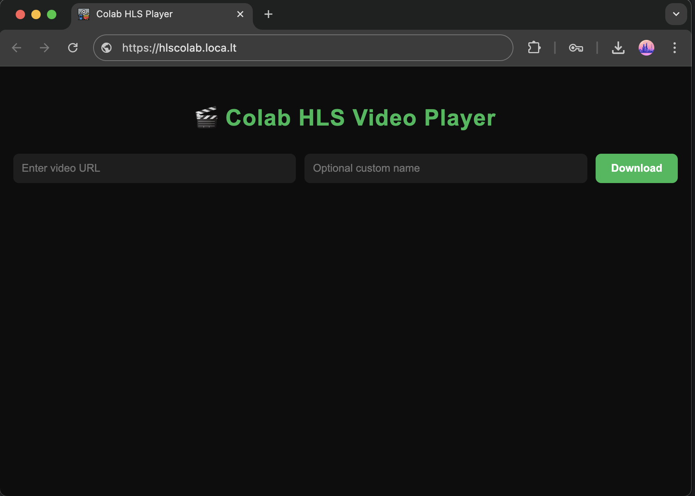

# HLS Media Streamer

**HLS Media Streamer** is a web application that allows users to download videos from the web, convert them to HLS format (`.ts` segments and `.m3u8` playlists), and stream them instantly. All backend processing is handled via a Google Colab notebook, enabling fast, scalable, and hassle-free video streaming.

---

## Features

- 🌐 Stream any video from the web within 1–2 minutes.
- ⚡ Fast processing and HLS generation on Google Colab.
- 🔀 Automatic conversion to HLS format (`.ts` segments + `.m3u8` playlist).
- 🗂️ Dynamic folder management and filename sanitization.
- 🧵 Threaded downloads for efficient processing.
- 💻 Responsive frontend to browse, stream, and manage videos.
- ⬇️ No hassle downloading – stream directly from the browser.

---

## Technologies Used

- **Backend:** Python, Flask, FFmpeg  
- **Frontend:** HTML, CSS, JavaScript  
- **Processing:** Google Colab Notebook (`.ipynb`)  

---

##Screenshot

## How to Run

1. **Open the Colab Notebook**:

   [HLS Media Streamer Notebook](movie_player.ipynb)

2. **Run all cells** – it will set up the environment, download videos, convert them to HLS format, and start the Flask server.  

3. Inside  your Colab and navigate to the **local tunnel link** shown in the Colab output (e.g., `https://xxxxxx.tunnel.com`).  
   To access the tunnel, you need to **paste your Colab session IP** in the local tunnel setup (e.g., `34.31.X.X`).

---

## How it Works

1. Users enter a video URL and optional custom name in the notebook frontend.  
2. The notebook downloads the video in the background using threads.  
3. FFmpeg converts the video to HLS format (`.ts` segments + `.m3u8` playlist).  
4. Flask serves the videos dynamically, and the frontend lists available videos for streaming.  
5. Users can stream videos directly from the browser or manage them (delete, rename).

---

## Author

**Darshan Purohit** – [GitHub](https://github.com/darshanpurohit20)

